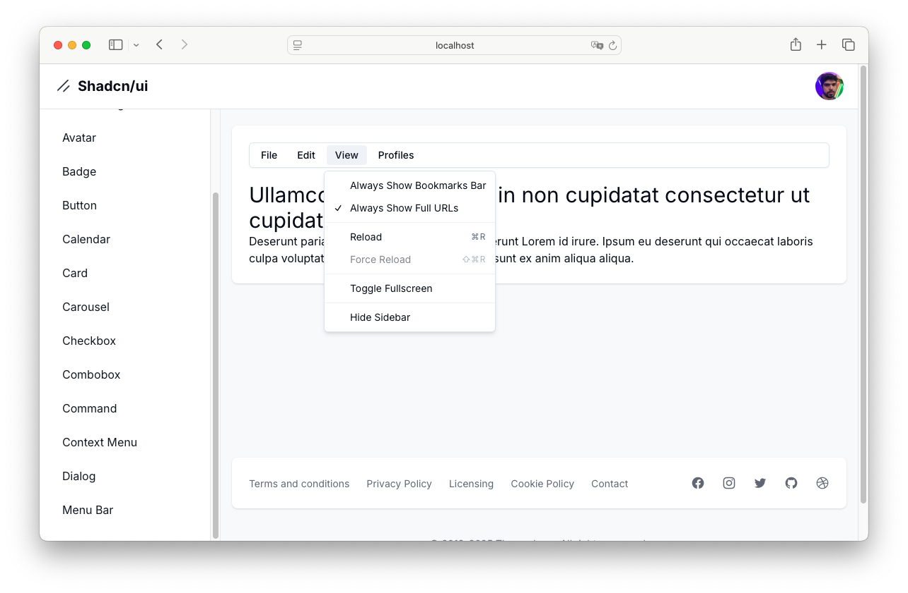

# shadcn dashboard

Este é um projeto [Next.js](https://nextjs.org/) desenvolvido para testar a criação de componentes com [shadcn/ui](https://ui.shadcn.com/).

## Observação

Eu notei que em determinado momento o comando _npx shadcn@latest add ..._ estava dando erro na instalação, então comecei a utilizar _npx shadcn@2.1.8 add ..._. Vi que há um Issue aberto: [6483](https://github.com/shadcn-ui/ui/issues/6483).

<p align="center">
  
</p>

## Passos para rodar o projeto

1. **Clone o repositório**

   ```bash
   git clone https://github.comcarlosxfelipe/shadcn-dashboard
   ```

   ```
   cd shadcn-dashboard
   ```

2. **Instale as dependências**

   ```bash
   npm install
   ```

3. **Execute o projeto**

   ```bash
   npm run dev
   ```

## Licença

Este projeto está licenciado sob a [MIT License](LICENSE). Sinta-se à vontade para usar e modificar o conteúdo conforme necessário.
